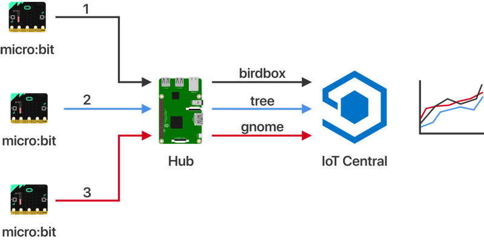

# How telemetry gets to IoT Central

This guide shows how telemetry is sent from a micro:bit and makes it to IoT Central.

> This guide doesn't cover how the mesh network sends messages, for that check out the [how the mesh network works architecture guide](./how-the-mesh-network-works.md)

The two problems with sending data from a micro:bit to the cloud are:

* micro:bits don't have internet connectivity, so rely on sending messages via another device to reach the internet
* micro:bit messages are limited to 19 characters

The first problem is solved by using a Hub device - a device that connects to the cloud and can relay messages from micro:bits. The second is solved by using codes for the data to reduce the message size, essentially a basic compression algorithm.

## Message flow

The message flow is:

1. A micro:bit sends a coded message
1. The Hub receives the message
1. The Hub decodes the message
1. The Hub makes a connection to IoT Central pretending to be the micro:bit
1. The decoded message is sent to IoT Central

## The Hub

The job of the Hub is to redirect messages to IoT Central. In traditional IoT scenarios, a single device connects to the cloud and sends telemetry as a single device. In this scenario, the Hub is acting as a gateway and re-routing messages from other devices, essentially pretending to be multiple devices at different times, probably using a set of fake noses and different hats.

A connection to IoT Central is created in code using a device client object, and this maintains a connection as a specific device. The Hub can pretend to be multiple devices by creating multiple connections, once per device.

When messages are received from a micro:bit, the relevant device connection for that device is used to send the message.

## Message encoding

Messages need to contain three pieces of information - the device that is sending the message, the type of data that is being sent, and the actual value.

### Device IDs

Device IDs in IoT Central can be multiple characters, and should be descriptive of the device. These IDs can't be used directly in a message. A device ID for example of `office-window-birdbox` would be 21 characters, 2 more than the maximum message size of 19 characters. Instead, device IDs can be encoded as one or two digit characters, for example `1` or `a`. The Hub stores a mapping table between the encoded device ID and the IoT central device ID. This means the micro:bit only needs to send the encoded ID reducing the number of characters sent.

Example:

* The micro:bit represents a device in IoT Central with an ID of `office-window-birdbox`
* The Hub has a mapping entry between `1` and `office-window-birdbox`
* When the micro:bit sends a message, it sends `1` as the device ID
* The Hub detects this encoded device ID of `1`, and maps it to `office-window-birdbox`
* The Hub connects to IoT Central as `office-window-birdbox` and sends the telemetry

### Value types

The data that the micro:bit sends can come from multiple different sensors. The data needs to be typed - so that when it is sent to IoT Central it can be assigned to the right telemetry value. The full names for sensor data can eat up a lot of the 19 character limit. For example `Temperature` is 11 characters. Just like with device IDs, these value types can be encoded as single characters and decoded on the Hub.

Example:

* The micro:bit detects the temperature
* A message is sent using a value type of `t`
* The Hub detects the encoded value type and maps it to `Temperature`
* The Hub sends the message to IoT Central as a `Temperature` value

### Values

Values are numbers, and so shouldn't be too large to send in the messages, especially if the number of decimal places is kept low.

Sending a single digit device ID and single digit value type, along with separators uses 4 characters. For example, a temperature value from device `1` would come in a message that starts `1:t:` leaving 15 characters remaining. This is more than enough space to send data.
