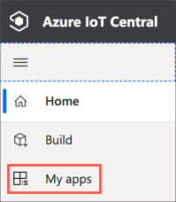

# Day 1 - Setup the cloud services

Todays project is to set up the cloud service. This service will take data from the micro:bits via the Raspberry Pi Hub and show it on a dashboard - for example showing temperatures from different smart ornaments on a graph and showing their locations on a map.

> This setup should be done by someone with experience setting up cloud services and who can access or sign up for an Azure subscription.

The cloud service that will be used is [Azure IoT Central](https://azure.microsoft.com/services/iot-central/?WT.mc_id=smart_garden_ornaments-github-jabenn), an IoT software-as-a-service platform. IoT Central allows you to configure apps - separate projects that can have one or more devices sending in data, as well as dashboard that you can use to see that data. In this case, the IoT Central app will be a project for your smart garden ornaments, connecting to your micro:bits to gather sensor data and plotting this data on a dashboard.

<!-- TODO - add dashboard screenshot -->

## Create an Azure subscription

To use Azure services you will need an Azure subscription. If you don't have a subscription you can sign up for free.

* If you are a student aged 18 and up and have an email address from an academic institution, you can sign up for the free Azure for Students offer at [azure.microsoft.com/free/students](https://azure.microsoft.com/free/students/?WT.mc_id=smart_garden_ornaments-github-jabenn) without a credit card. At the time of writing this gives you $100 of credit to use over 12 months, as well as free tiers of a number of services for that 12 months. At the end of the 12 months, if you are still a student you can renew and get another $100 in credit and 12 months of free services.

* If you are not a student, you can sign up at [azure.microsoft.com/free](https://azure.microsoft.com/free/?WT.mc_id=smart_garden_ornaments-github-jabenn). You will need a credit card for verification purposes only, you will not be billed unless you decide to upgrade your account to a paid offering. At the time of writing the free account will give you US$200 of free credit to spend on what you like in the first 30 days, 12 months of free services, plus a load of services that have tiers that are always free.

## Create an Azure IoT Central app

Azure IoT Central uses the term 'App' to refer to a project containing one or more devices, along with dashboards, rules, the ability to export data and other capabilities.

### Log in to IoT Central

1. Head to [apps.azureiotcentral.com](https://apps.azureiotcentral.com/?WT.mc_id=smart_garden_ornaments-github-jabenn)

1. From the side bar menu, select **My apps**

    

1. Log in with the account you used to set up your Azure Subscription

### Create the app

1. From the top of the page, select **+ New application**

    

1. Select **Custom apps** from teh *Featured* section

    

1. Fill in the application details

    1. Give the application a name, such as `Smart Garden Ornaments`

    1. Set the URL for your application. This URL needs to be unique across *all* IoT Central applications, so add something unique to it such as your name, date, anything like that. For example, the URL `smart-garden-ornaments` probably won't be available, but `jims-smart-garden-ornaments` might be available. As this will form part of the web address of the app it can't contain spaces or other special characters - you should only use numbers, letters, and hyphens.

    1. Select **Custom application** for the *Application template*

    1. Select the **Standard 1** pricing plan. This plan is free for the first two devices, with a limit of about 6-7 messages an hour per device, which should be more than enough for the kind of data you will be collecting. More devices are US$0.40 per month per device at the time of writing.

        > There is a free tier allowing up to 5 devices. Apps created with the free tier are deleted after 7 days, so the Standard 1 tier allows you to keep your apps for as long as you need.

    1. In the *Billing info* section, select your *Directory* and *Azure Subscription*. If you only have one subscription, then there will only be one directory to select, if you have multiple (for example a work or university subscription and a personal free subscription), select the appropriate directory.

    1. Select the nearest location to you.

        > The location determines which Azure Region the app will be created in. Azure has multiple regions all around the world, and you always want to select the one closest to where your devices will be connecting from. You can read more about Azure Regions including seeing where they are in the [Azure regions documentation](https://azure.microsoft.com/global-infrastructure/regions/?WT.mc_id=smart_garden_ornaments-github-jabenn).

    

1. Once the form is filled in, select **Create**

    

### Create a device template

Before you can send data to IoT Central, you need to tell it what data to expect and what format that data is in. This is done using device templates. Device templates describe how to interact with a certain type of device, and each IoT Central app can have multiple device templates.

Device templates allow you to define the following:

* Telemetry - this is data sent by the device and shown on IoT Central. This is transient data - so if the device is disconnected the values are lost. For example the current detected temperature.
* Properties - this is data that can be set by the device or IoT Central and is kept in sync between the two. This is non-transient data, so if a device is offline when the value is set in IoT Central, it will be retrieved next time the device is online. For example indicating if a light should be turned on.
* Commands - these are requests from IoT Central for the device to perform an action. For example in a agriculture system a command could instruct a watering system to turn on the water supply
* Cloud properties - these are values stored in IoT Central against a device, and are never sent to the device. For example the location of the device.
* Views - these are dashboards that can be created against a device to view data or send commands.

There is a small complexity to device templates - namely versioning. IoT Central is great for hobbyists and makers as it is less complex than setting up an IoT solution using many different pieces, but it is still capable of supporting professional use. To support professional users building production applications, device templates come with interfaces that define the telemetry, properties and commands that a device supports, and these interfaces are versioned, meaning that you can't delete items from the template, only add. That way you can't break an existing device template - imagine changing the name of a property after you've deployed a million devices sending data with the old name!

To start with, the device template will have an interface to collect the temperature, and in later days you will version this interface to add more telemetry values.

### Create devices

### Create a dashboard
