# Day 3 - Build a micro:bit sensor mesh network

> 
>
> **This day has sections that require someone confident in setting up and programming a Raspberry Pi, and sections requiring someone confident using block based programming on a BBC micro:bit. You will also need access to IoT Central to see the temperature data**

Yesterday you set up the Pi and micro:bit based connection hub that can route messages to Azure IoT Central. Today you will create the sensors using micro:bits, as well as setting up a mesh network to allow the micro:bits to send messages through each other.

Each micro:bit as an on-board temperature sensor, and you can use this to get the current temperature wherever the micro:bit is positioned. This will then be sent to IoT Central via the hub, by sending a radio message.

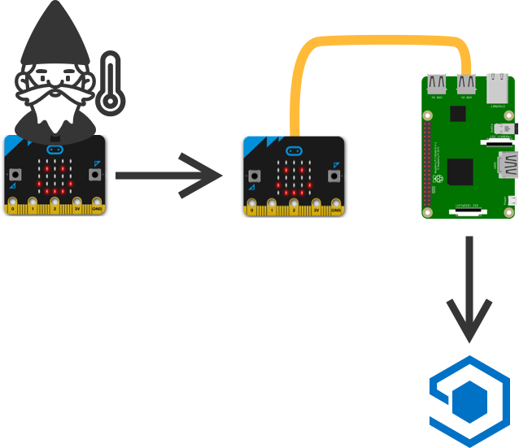

The steps you'll take to do this are:

* Code multiple micro:bits to send temperature data as radio messages
* Configure the Pi to map device codes to IoT Central device IDs
* Configure IoT Central to show the devices on the dashboard
* Code up the mesh network

## Prepare the hardware

You will need:

* Two or more micro:bits to act as sensors
* Battery packs for the micro:bits with appropriate batteries
* Blank stickers to put labels on the micro:bits

## Code the temperature sensor

> 
>
> **This section requires someone confident using block based programming on a BBC micro:bit**

As described in yesterdays part, the micro:bit can only send radio messages with up to 19 characters, which is not a lot. To ensure the data fits, it is sent like this:

```sh
<device_code>:<data_type_code>:<data_value>
```

The `<device_code>` is used to look up which device send the message. The `<data_type_code>` is used to get the type of data, such as a temperature value, as well as the type of the data such as a number or text. `<data_value>` is the actual data.

One example would be:

```sh
1:t:25
```

This would be from a device with code `1` which will be used to get the actual IoT Central device ID, and contain a temperature value of 25°C which will be sent as a number.

> You can read more on how this works in the [how telemetry is sent from a micro:bit to IoT Central architecture guide](../architecture-guides/how-telemetry-gets-to-iot-central.md).

Each micro:bit needs to have a unique code that can be mapped by the hub to the full device ID. To send the temperature, the micro:bit needs to get the temperature, create a coded message and send that over the radio.

### Code the micro:bit

#### Configure the radio

The first step is to configure the radio, setting the group and setting the power as high as possible. You can change the amount of power used by the micro:bit to send data over the radio on a scale of 1-7 - the more power, the further the radio signals can go. Ideally you want the power setting to be as high as possible.

1. From your browser, head to [makecode.microbit.org](https://makecode.microbit.org/)

1. Select **+ New Project** from the *My Projects* section

    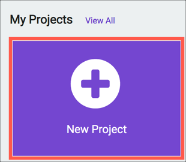

1. Name your project `microbit temperature sensor`, then select **Create**

    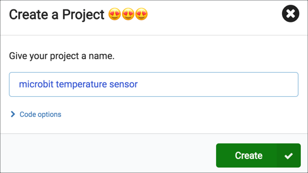

1. This micro:bit needs to be on the same radio group as the one connected to the hub. Select the **Radio** toolbox item and drag **radio set group `1`** to the **on start** block

    

1. Select **... more** under the **Radio** toolbox item

    

1. Drag **radio set transmit power `7`** to the **on start** block below the **radio set group** block.

    

    Make sure the power value is set to 7, the highest transmission power. If the value is less than 7 then select it drag the slider till the value is 7.

    > At this power in an open area the signal can reach up to 70 meters

#### Configure the device ID

Each sensor needs a unique ID that can be mapped by the hub. This needs to be sent with each message. To keep the code as clean as possible, this device ID can be defined as a variable in one place and used later. That way the same code can be easily deployed to every micro:bit sensor with only a small change to the device ID.

1. Number all of your micro:bits by putting numbered stickers on them so you can easily identify which is which

    

1. In MakeCode, select the **Variables** toolbox item

    

1. Select **Make a Variable...**

    

1. Name the variable `device id`

    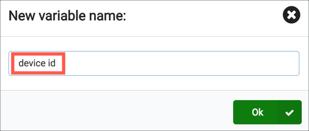

1. Select **OK**

1. Select the **Variables** toolbox item. You will see extra options for the new variable.

1. Drag the **set `device id` to `0`** block into the **on start** block

    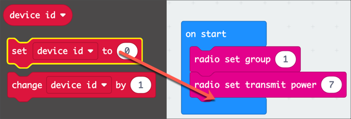

1. Change the value that is being set to the number you have given your first micro:bit, for example `1`. Select the number in the block and type the new value.

    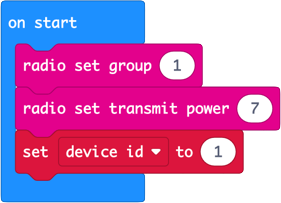

#### Build and send the message

The sensor needs to detect the temperature and send this as a message over the radio. This message needs to be built up from the device ID, the type of telemetry that is being sent and the value.

> Although the temperature is the only value being sent now, it is better to have a generic way to build messages for any data so it is easier to add more sensors later

This message can be built in a function - a special type of block you can create with other blocks inside that can be called from other places. It keeps your code cleaner by giving you a way to label blocks of code.

1. Expand the *Advanced* tab in the toolbox and select the **Functions** toolbox item

    

1. Select **Make a Function...**

    

1. Select the function name which defaults to `doSomething` and change it to `Send message`

    

1. Select the **Text** option in the *Add a parameter* section to add a text parameter. Name this `Type`.

    

1. Select the **Number** option to add a number parameter, and name this `Value`

    

1. Select **Done** to create the function

    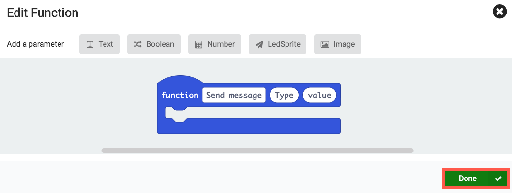

1. Create a new variable called `message to send` in the same way you created the `device id` variable earlier

1. From the **Variables** toolbox, drag the **set `message to send`** block into the **Send message** function block.

    > If you don't see a **set `message to send`** block, but you do see a **set `device id`** block, drag this instead and use the drop down on the variable name to select the `message to send` variable

1. Expand the **Text** toolbox item in the *Advanced* tab, and drag the **join `"Hello"` `"world"` - +** block into the **set `message to send`** block and on top of the value being set

    

1. The message format is `device id:type:value`, so the join block needs to connect these different variables using a `:`. Start by dragging the **device id** variable block from the **Variables** toolbox item over the `"Hello"` value in the **Join** block.

    

1. Select the `"World"` value and change it to `:`

    

1. Select the **+** button in the **Join** block to add three more parameters. There should be five in total.

    

1. Drag the `Type` variable from the function block into the third parameter

    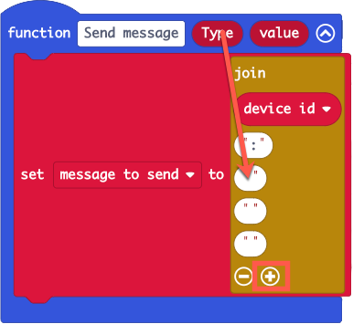

1. Set the fourth parameter to `:`

1. The final parameter needs to be the value. The value coming in to the function is a number, so this needs to be converted to a text value first. From the **Text** toolbox item, drag a **convert `0` to text** block into the fifth parameter.

    

1. Drag the `Value` parameter to the function to the `0` in the **convert to text** block

    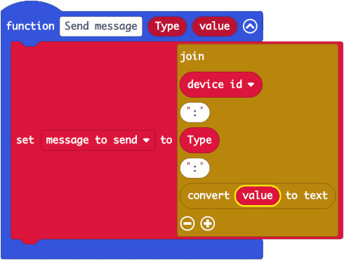

1. From the **Radio** toolbox item, drag a **radio send string `" "`** block to the function and place it below the **set `message to send`** block

1. From the **Variables** toolbox item, drag the `message to send` variable into the **radio send string `" "`** block

The `Send message` function is now complete, and should look like this:


### Get data from the temperature sensor

The `Send message` function is ready to be called with the current temperature value. This value should be read then sent every 10 minutes in a **forever** block.

1. From the **Functions** toolbox item, drag the **call send message `"abc"` `1`** block to the **forever** block

    

1. Set the first parameter to be `t` to indicate that a temperature value is being sent

    

1. From the **Input** toolbox item, drag the **temperature (°C)** block to the second parameter in the **call send message** block

    

1. From the **Basic** toolbox item, drag a **pause** block to the **forever** block and set the value to 600,000. This is 10 minutes in milliseconds

The **forever** block should look like this:

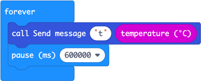

### Copy the code to the micro:bits

The code should look like this:

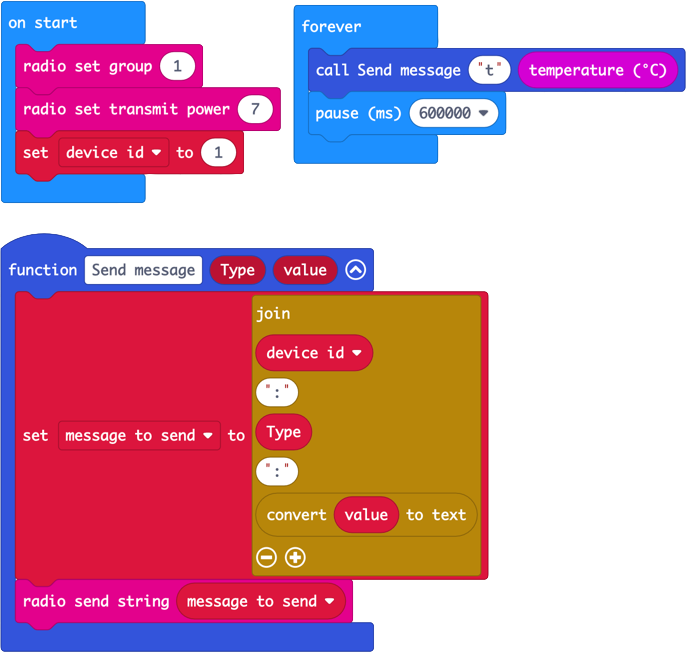

When the micro:bit starts up, it sets the device id and configures the radio. In the forever loop it gets the temperature and passes it to the Send Message function which builds up the coded message and sends it to the radio.

This now needs to be downloaded to the micro:bits you are using as sensors.

**NOTE** - you can't download identical code - each micro:bit needs a unique ID.

1. Connect the first micro:bit to your computer

1. Make sure the value of the `device id` variable matches the number on the sticker on your micro:bit

    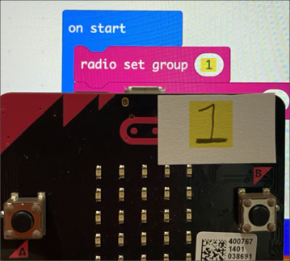

1. Download the code either using one-click downloads on Edge by pairing your device and selecting the **Download** button, or download the hex file and drag it to your device.

1. Connect the next micro:bit to your computer

1. Update the `device id` variable to match the micro:bits's number

1. Download the code either using one-click downloads on Edge by pairing your device and selecting the **Download** button, or download the hex file and drag it to your device.

1. Repeat until all the micro:bits have been programmed

## See the temperature data

> 
>
> **This section requires someone confident in setting up and programming a Raspberry Pi, and someone with access to IoT Central**

Before you can see the temperature on the IoT Central dashboard, you need to set up all the devices.

### Configure the device mappings on the Pi

The Pi code will automatically create new devices in IoT Central for any devices that connect to it. The micro:bits only send a coded device id, so the mapping between the micro:bits device code and the device ID that you want to use in IoT Central needs to be set before the devices can be automatically registered.

1. From the Pi, open the `mappings.py` file from the `PiHub` folder in the Pi's home directory using your favorite text editor. For example Visual Studio Code via the remote development extension, or `nano` via SSH.

1. The code has the device mappings defined using a Python dictionary:

    ```sh
    devices = {
        "1" : "jim-window-birdbox",
    }
    ```

1. Add lines for all the micro:bits that you have set up, mapping the device ID you used on each micro:bit to a name that makes sense. For example:

    ```sh
    devices = {
        "1" : "jim-window-birdbox",
        "2" : "front-of-house-birdbox",
        "3" : "next-door-gnome",
    }
    ```

1. Reboot the Pi to relaunch the Python app to start using the new mappings.

### Power up the micro:bits

The micro:bits need power to start collecting snd sending data.

1. Connect a battery pack to each micro:bit

1. The micro:bits will start up and start capturing temperature data

1. Position the micro:bits in places with different temperatures, but still close to the hub

Every 10 minutes a temperature value will be sent from each micro:bit, via the hub to the IoT Central app. The hub will look up the device id from the code sent by the micro:bit and register that device in IoT Central if it doesn't already exist.

### Configure devices in IoT Central

The Pi Hub will register new devices in IoT Central when it gets a message from a device that hasn't already been registered. Unfortunately it can't configure the device fully, IoT Central doesn't support fully configuring devices remotely yet.

1. Open the app in IoT Central

1. Select the *Devices* tab from the side bar menu

1. There will be two groups showing in the templates list - *All devices* and *Smart garden ornament*. Select *All devices*

    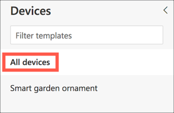

You will see the first device you created when testing out the Hub, as well as any new devices create. The existing device will have a device status of **Provisioned** and the device template set as **Smart garden ornament**. The new devices will have a status of **Unassociated** and the device template will be set as **Undefined**. Each new device will need to be migrated to use the Smart garden ornament device template.

1. Select the first device to migrate by checking the box at the start of the row

    

1. Select the **Migrate** button

    

1. From the **Migrate** dialog, select the *Smart garden ornament* template, then select **Migrate**

    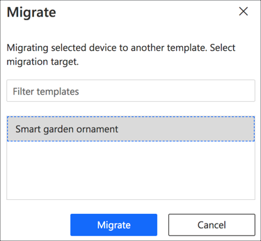

1. You will see progress pop up on the side. Once the device is migrated, the name will change color and you will be able to select it.

1. Select the new device from the list

1. Select the **micro:bit location** tab

1. Search for the location of your smart garden ornament, or select it on the map. The search can find an address, and the map can be used to get a more precise location at that address. For example, if you had one positioned outside the South door of Microsoft Building 92 in Redmond, WA, USA you could:

    1. Search for `Microsoft Building 92`

        

    1. Select it when it comes up

        

    1. Zoom in and click on the map to move the pin to a more accurate position

        

1. Select **Save**

1. Repeat this for all the new devices

### View the temperature data on the dashboard

When you set up the dashboard, you added the first device. The new devices don't get added by default, so you need to manually add them.

1. Select the *Dashboard* tab from the side bar menu

1. Select the **Edit** button

    

1. Select the cog in the Temperature tile on the dashboard to open the **Configure chart** pane

1. Drop down the *Device instance* box and check all the devices

    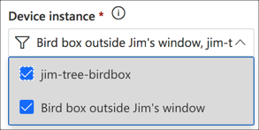

1. Select **Update**

1. Repeat this process for the Location tile

1. Select the **Save** button

The data will be updated to show all devices - they will all appear on the map, and you will begin to see temperature data appear. After a while the temperature graph will fill out.

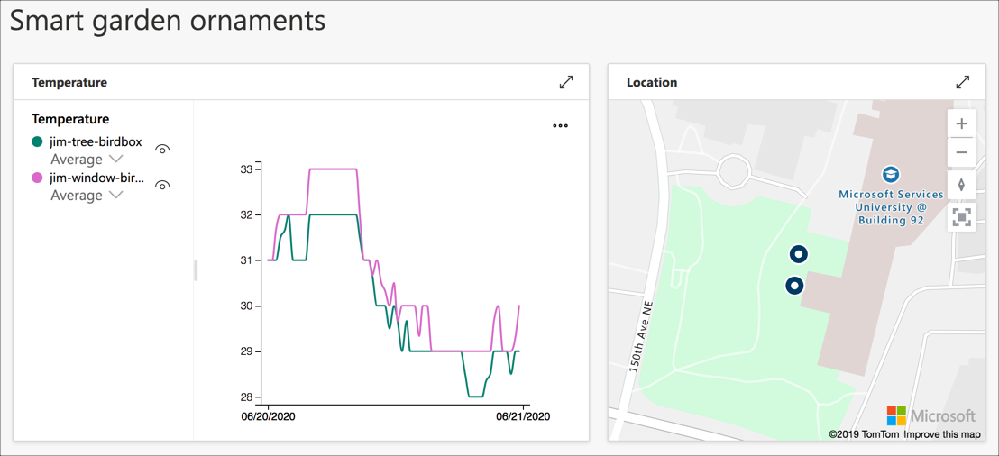

## Mesh networks

micro:bits have a radio that in clear air can send data about 70 meters. This distance drops as things get in the way of the radio transmission, such as walls or whatever garden ornament the device is inside. Because of this, the current setup is limited - all micro:bits have to be close to the Hub to get data to the cloud.

A way to work around this is a mesh network. Mesh networks by having multiple devices connected to the mesh, known as nodes, and each one can forward on messages until they reach the Hub.

> There are a number of professional mesh networking standard used every day, such as [Zigbee](https://zigbeealliance.org), which is used in home automation. These are a lot more complicated than the version here, and include things like security.

For example, if you had 2 micro:bits numbered 1 and 2, with 1 too far from the Hub to send a message, but 2 is half way between 1 and the Hub, and close enough to both to send a receive messages. If 2 sends a message, the Hub can receive it. If 1 sends a message, the Hub can't receive it, but 2 can - so 2 receives the message and re-sends it to the Hub. That way the message jumps from 1 to 2 to the Hub.


To build this in the micro:bits involves adding blocks to receive radio messages, the same as the Hub micro:bit does, but instead of sending them to the serial connection, re-send the exact same message

There are a number of problems that need to be overcome.

The first is ensuring messages don't constantly bounce around - having 1 send a message, 2 receives it and sends it, 1 then receives it from 2 and re-sends it, 2 receives it and re-sends it and so on for ever. The way round this is to check the device code, and if the code matches the device, don't resend. For example, if 2 re-sends a message from 1, and 1 receives this it can see that the message originally came from itself, so doesn't need to resend.

The second problem is when you have more than 2 devices - if 1 sends a message it could bounce between 2 and 3 forever. This can be avoided because we know how often messages are sent - every 10 minutes. When a device gets a message from a device it can track the time it was received. If it gets the same message within 9 minutes ( to allow time for message delays) then it can be ignored. For example, 1 sends a message at 9AM. 2 receives it and stores it got a message from 1 at 9AM. If it receives a message from 1 again that was re-sent by 3 at 9:01AM, it will see that the time difference is less than 9 minutes and not resend.

micro:bits can't actually keep track of the real time, but they do track how many seconds since they last restarted, so this time can be used to determine the time since the last message.

## Code the micro:bit mesh network

The mesh network code is a bit more complicated than the code you wrote earlier to send messages. Instead of writing this code by hand, it is available [on GitHub](https://github.com/jimbobbennett/smart-garden-ornaments-microbit-device).

### Write the code

1. From your browser, head to [makecode.microbit.org](https://makecode.microbit.org/)

1. Select the **Import** button from the *My Projects* section

    

1. Select **Import URL...**

    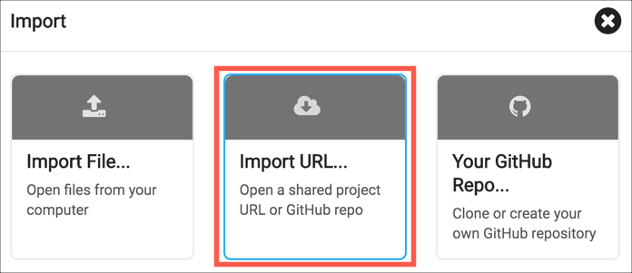

1. In the **Copy the URL of the project.** box, add the following URL:

    ```output
    https://github.com/jimbobbennett/smart-garden-ornaments-microbit-device
    ```

1. Select the **Go ahead!** button

    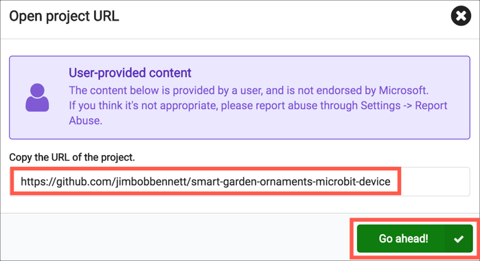

This will create a new project pre-configured with the code for the mesh network.

The code will check the temperature and send it every 10 minutes, showing a duck icon using the LEDs when the message is sending. It will also listen for messages from other devices, and re-send them once every 9 minutes. When a message is received, it will show a small diamond using the LEDs, and if the message is one to resend it will show a tick, otherwise it will show a cross.

> You can read more on how this works in the [how the mesh network works architecture guide](../architecture-guides/how-the-mesh-network-works.md).

### Download the code to the micro:bits

You can download the code using the same instructions as before - changing the device ID before downloading the code.

1. Connect the first micro:bit to your computer

1. Make sure the value of the `device id` variable in the `on start` block matches the number on the sticker on your micro:bit

    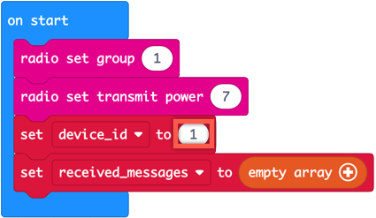

1. Download the code either using one-click downloads on Edge by pairing your device and selecting the **Download** button, or download the hex file and drag it to your device.

1. Connect the next micro:bit to your computer

1. Update the `device id` variable to match the micro:bits's number

1. Download the code either using one-click downloads on Edge by pairing your device and selecting the **Download** button, or download the hex file and drag it to your device.

1. Repeat until all the micro:bits have been programmed

### Test the mesh network

To test the mesh network, you will need power for the micro:bits, as well as some space to test them out. You will also need an assistant to make it easier!

1. Make sure the Hub is running and the Hub micro:bit is connected and the heartbeat is visible on the LEDs

1. Connect one of the device micro:bits to a battery pack and power it on. You will see an umbrella icon flash on the device micro:bit to show it's sending a message, and a duck on the Hub micro:bit to show it's received the message.

1. Ask your assistant to stay by the Hub microbit and check for when messages are received. Move away from the Hub, and every few meters press the reset button on the micro:bit. Each time the micro:bit is reset it will immediately send a message (to save waiting for the message sent every 10 minutes). Ask your assistant to confirm if they see the duck icon on the Hub each time.

1. Keep moving away until you are too far for the Hub to detect the message. Leave your micro:bit at that location.

1. Position a second micro:bit between the first one and the Hub and connect the battery pack. You will see the umbrella image to show it's sending a message, and a duck on the Hub to show the message was received.

1. Reset the first micro:bit to get it to send a message. You will see a tick appear on the second micro:bit and the duck appear on the Hub. This shows a message has gone from the first micro:bit to the second, then from the second to the Hub.

1. Repeat this with all the micro:bits you have, positioning them away from the Hub, but close to another micro:bit. Each time you should see the message moving from one micro:bit to another all the way to the Hub.

## Summary

You've completed todays project - building the mesh network of micro:bits. [Tomorrow](./4-build-garden-ornament.md) you'll build your first smart garden ornament and position the sensors to start collecting data.
