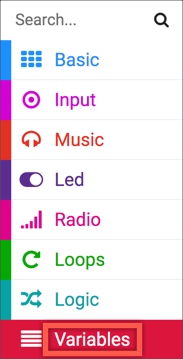
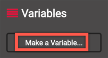
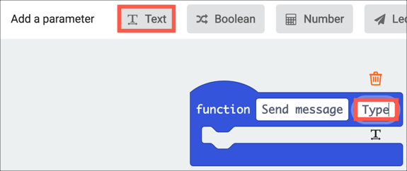
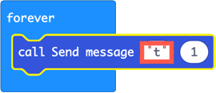

# Build a micro:bit sensor mesh network

> 
>
> **This day has sections that require someone confident in setting up and programming a Raspberry Pi, and sections requiring someone confident using block based programming on a BBC micro:bit. You will also need access to IoT Central to see the temperature data**

Yesterday you set up the Pi and micro:bit based connection hub that can route messages to Azure IoT Central. Today you will create the sensors using micro:bits, as well as setting up a mesh network to allow the micro:bits to send messages through each other.

Each micro:bit as an on-board temperature sensor, and you can use this to get the current temperature wherever the micro:bit is positioned. This will then be sent to IoT Central via the hub, by sending a radio message.

<!-- TODO - picture -->

The steps you'll take to do this are:

* Code multiple micro:bits to send temperature data as radio messages
* Configure the Pi to map device codes to IoT Central device IDs
* Configure IoT Central to show the devices on the dashboard
* Code up the mesh network

## Prepare the hardware

You will need:

* Two or more micro:bits to act as sensors
* Battery packs for the micro:bits with appropriate batteries
* Blank stickers to put labels on the micro:bits

## Code the temperature sensor

As described in yesterdays part, the micro:bit can only send radio messages with up to 19 characters, which is not a lot. To ensure the data fits, it is sent like this:

```sh
<device_code>:<data_type_code>:<data_value>
```

The `<device_code>` is used to look up which device send the message. The `<data_type_code>` is used to get the type of data, such as a temperature value, as well as the type of the data such as a number or text. `<data_value>` is the actual data.

One example would be:

```sh
1:t:25
```

This would be from a device with code `1` which will be used to get the actual IoT Central device ID, and contain a temperature value of 25°C which will be sent as a number.

> You can read more on how this works in the [how telemetry is sent from a micro:bit to IoT Central architecture guide](../architecture-guides/how-telemetry-gets-to-iot-central.md).

Each micro:bit needs to have a unique code that can be mapped by the hub to the full device ID. To send the temperature, the micro:bit needs to get the temperature, create a coded message and send that over the radio.

### Code the micro:bit

#### Configure the radio

The first step is to configure the radio, setting the group and setting the power as high as possible. You can change the amount of power used by the micro:bit to send data over the radio on a scale of 1-7 - the more power, the further the radio signals can go. Ideally you want the power setting to be as high as possible.

1. From your browser, head to [makecode.microbit.org](https://makecode.microbit.org/)

1. Select **+ New Project** from the *My Projects* section

    

1. Name your project `microbit temperature sensor`, then select **Create**

    

1. This micro:bit needs to be on the same radio group as the one connected to the hub. Select the **Radio** toolbox item and drag **radio set group `1`** to the **on start** block

    

1. Select **... more** under the **Radio** toolbox item

    

1. Drag **radio set transmit power `7`** to the **on start** block below the **radio set group** block.

    

    Make sure the power value is set to 7, the highest transmission power. If the value is less than 7 then select it drag the slider till the value is 7.

    > At this power in an open area the signal can reach up to 70 meters

#### Configure the device ID

Each sensor needs a unique ID that can be mapped by the hub. This needs to be sent with each message. To keep the code as clean as possible, this device ID can be defined as a variable in one place and used later. That way the same code can be easily deployed to every micro:bit sensor with only a small change to the device ID.

1. Number all of your micro:bits by putting numbered stickers on them so you can easily identify which is which

    

1. In MakeCode, select the **Variables** toolbox item

    

1. Select **Make a Variable...**

    

1. Name the variable `device id`

    

1. Select **OK**

1. Select the **Variables** toolbox item. You will see extra options for the new variable.

1. Drag the **set `device id` to `0`** block into the **on start** block

    

1. Change the value that is being set to the number you have given your first micro:bit, for example `1`. Select the number in the block and type the new value.

    

#### Build and send the message

The sensor needs to detect the temperature and send this as a message over the radio. This message needs to be built up from the device ID, the type of telemetry that is being sent and the value.

> Although the temperature is the only value being sent now, it is better to have a generic way to build messages for any data so it is easier to add more sensors later

This message can be built in a function - a special type of block you can create with other blocks inside that can be called from other places. It keeps your code cleaner by giving you a way to label blocks of code.

1. Expand the *Advanced* tab in the toolbox and select the **Functions** toolbox item

    

1. Select **Make a Function...**

    

1. Select the function name which defaults to `doSomething` and change it to `Send message`

    

1. Select the **Text** option in the *Add a parameter* section to add a text parameter. Name this `Type`.

    

1. Select the **Number** option to add a number parameter, and name this `Value`

    

1. Select **Done** to create the function

    

1. Create a new variable called `message to send` in the same way you created the `device id` variable earlier

1. From the **Variables** toolbox, drag the **set `message to send`** block into the **Send message** function block.

    > If you don't see a **set `message to send`** block, but you do see a **set `device id`** block, drag this instead and use the drop down on the variable name to select the `message to send` variable

1. Expand the **Text** toolbox item in the *Advanced* tab, and drag the **join `"Hello"` `"world"` - +** block into the **set `message to send`** block and on top of the value being set

    

1. The message format is `device id:type:value`, so the join block needs to connect these different variables using a `:`. Start by dragging the **device id** variable block from the **Variables** toolbox item over the `"Hello"` value in the **Join** block.

    

1. Select the `"World"` value and change it to `:`

    

1. Select the **+** button in the **Join** block to add three more parameters. There should be five in total.

    

1. Drag the `Type` variable from the function block into the third parameter

    

1. Set the fourth parameter to `:`

1. The final parameter needs to be the value. The value coming in to the function is a number, so this needs to be converted to a text value first. From the **Text** toolbox item, drag a **convert `0` to text** block into the fifth parameter.

    

1. Drag the `Value` parameter to the function to the `0` in the **convert to text** block

    

1. From the **Radio** toolbox item, drag a **radio send string `" "`** block to the function and place it below the **set `message to send`** block

1. From the **Variables** toolbox item, drag the `message to send` variable into the **radio send string `" "`** block

The `Send message` function is now complete, and should look like this:


### Power up the sensors

The `Send message` function is ready to be called with the current temperature value. This value should be read then sent every 10 minutes in a **forever** block.

1. From the **Functions** toolbox item, drag the **call send message `"abc"` `1`** block to the **forever** block

    

1. Set the first parameter to be `t` to indicate that a temperature value is being sent

    

1. From the **Input** toolbox item, drag the **temperature (°C)** block to the second parameter in the **call send message** block

    

1. From the **Basic** toolbox item, drag a **pause** block to the **forever** block and set the value to 600,000. This is 10 minutes in milliseconds

The **forever** block should look like this:


### Copy the code to the micro:bits

The code should look like this:


When the micro:bit starts up, it sets the device id and configures the radio. In the forever loop it gets the temperature and passes it to the Send Message function which builds up te coded message and sends it to the radio.

This now needs to be downloaded to the micro:bits you are using as sensors.

**NOTE** - you can't download identical code - each micro:bit needs a unique ID.

1. Connect the first micro:bit to your computer

1. Make sure the value of the `device id` variable matches the number on the sticker on your micro:bit

    

1. Download the code either using one-click downloads on Edge by pairing your device and selecting the **Download** button, or download the hex file and drag it to your device.

1. Connect the next micro:bit to your computer

1. Update the `device id` variable to match the micro:bits's number

1. Download the code either using one-click downloads on Edge by pairing your device and selecting the **Download** button, or download the hex file and drag it to your device.

1. Repeat until all the micro:bits have been programmed

## See the temperature data

### Configure the device mappings on the Pi

### Configure devices in IoT Central

### View the temperature data on the dashboard

## Mesh networks

micro:bits have a radio that in clear air can send data about 70 meters. This distance drops as things get in the way of the radio transmission, such as walls or whatever garden ornament the device is inside. Because of this, 

<!-- TODO - picture -->

## Code the micro:bit mesh network

### Write the code

### Test the mesh network

## Summary
