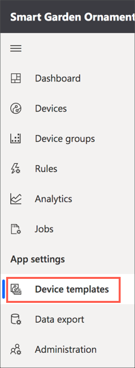
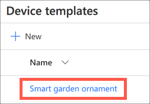
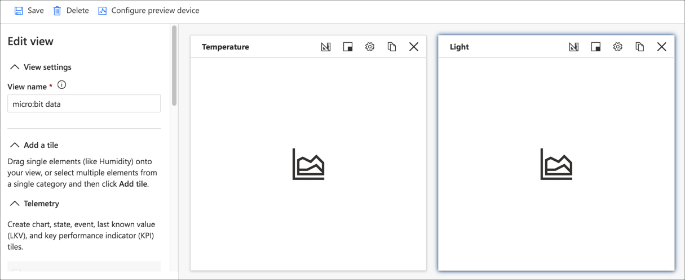
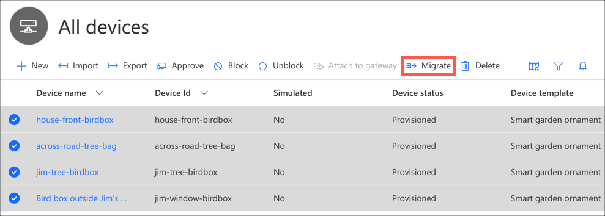

# Day 5 - add more sensors to gather more data

> 
>
> **This day has sections that require someone confident in setting up and programming a Raspberry Pi, and sections requiring someone confident using block based programming on a BBC micro:bit. You will also need access to IoT Central to add new data types to the device template**

Yesterday you built the smart garden ornaments and set them up around your house. Today's project is to add more sensors to capture more data.

So far you've used the temperature sensor built into the micro:bit. But this is not the limit - there are so many more sensors you can use to gather data! Todays part will cover three sensors - one on board and two external. You will learn how to add a new sensor and start gathering data

The steps you'll take to do this are:

* Build or wire up the sensor if required
* Add code to the micro:bit to gather data from the sensor
* Add code to the Pi to understand the sensor value
* Add the new sensor value to IoT Central and show it on the dashboard

## Light sensors

A light sensor is the simplest sensor to add as the micro:bit already has one on-board, meaning no external hardware needed.

> This light sensor is not particularly accurate, as it uses the LEDs as light sensors. You can read more on this in the [micro:bit light sensor documentation](https://support.microbit.org/support/solutions/articles/19000024023-how-does-the-light-sensing-feature-on-the-micro-bit-work-).

### Add light values to IoT Central

In IoT Central, a device template was configured to receive temperature values and plot these on a graph. To add new sensor data, the device template needs to be configured to accept another value.

#### Version the interface

THis is not a simple case of adding a new value to the templates. Device templates cannot be changed once they are published and available to use, this is to stop someone breaking a template that has been published with thousands of devices sending data. Instead, you can create a new version of the existing device template, and add a new telemetry value to it. Once this new version has been created, devices can be migrated to this new version.

1. Open your IoT Central app

1. From the side bar menu select **Device templates**

    

1. Select the `Smart garden ornament` device template

    

1. Select the **Version** button to create a new version of this template

    

1. Leave the new name as `Smart garden ornament v2`, and select the **Create** button

    

1. Select the *Interface*

    

1. Select **Version** from the interface menu

    

1. Select **Create** from the dialog

    

The new interface version will be created as a copy of the original. The `Temperature` value will be there, with some fields read-only. For example, you can't change the name, the capability type or schema - doing so would break what existing devices can send.

#### Add the new capability

1. Add a new capability in the same way you did to add temperature originally. Set the *Display name* and *Name* to `Light`. Leave the *Capability type* as `Telemetry`, the *Semantic type* as `None` and the *Schema* as `Double`.

    

1. Select **Save**

1. Select the *micro:bit data* view

    

1. Add the Light tile in the same way you did for temperature, and configure it how you want

    

1. Select **Save**

#### Publish the new interface

1. Select **Publish** from the top menu

    

1. Select **Publish** from the publish dialog that appears

    

#### Migrate devices

1. From the side bar menu select **Devices**

1. Select the *All devices* group

1. Select all the devices by selecting the check box at the start of each row

    

1. Select **Migrate**

    

1. Select the *Smart garden ornament v2* template, then select **Migrate**

    

1. A progress dialog will pop out the side and show migration progress. Close this once the devices have been migrated.

    

#### Update the dashboard

The dashboard show the device locations and temperature values. TO show light values, a new tile needs to be added.

1. From the side bar menu, select **Dashboard**

1. Select the **Edit** button on the top menu

1. Add and configure a tile for the Light values in the same way you added the Temperature tile. Ensure all the devices are selected and the time range matches the time range you set for the temperature.


<!-- To Do - add this once the data is showing -->

### Add a mapping to the Hub for the light values

Once IoT Central is ready to receive light values, a mapping needs to tbe added to the Hub so that the micro:bits can send the light values using a code to keep the meesgae size down.

1. From the Pi, open the `mappings.py` file

1. Edit the `value_types` dictionary to have a new entry mapping `l` to `Light`

    ```python
    value_types = {
        "t" : "Temperature",
        "l" : "Light",
    }
    ```

1. Reboot the Pi to start the code with the new mappings

### Send the light value from the micro:bit

1. Edit the code for the micro:bits used in the smart garden ornaments

1. Add a new `call Send_message` block from the **Functions** toolbox to the `forever` block

    

1. Set the `Type` parameter to `"l"`

1. Drag a `light level` block from the **Input** toolbox to the `value` parameter

    

1. Download this code to all the micro:bits. Don't forget to update the device IDs as you download the code.

## Soil moisture

## Noise

## Summary
