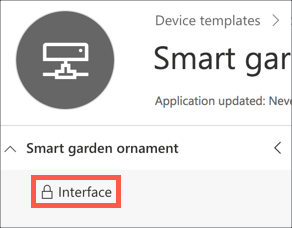
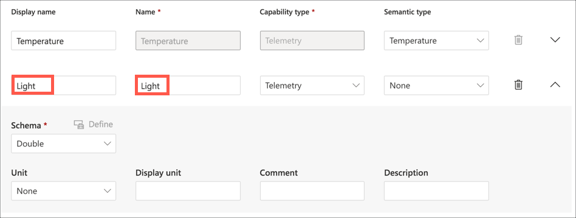
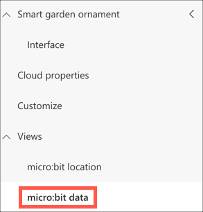
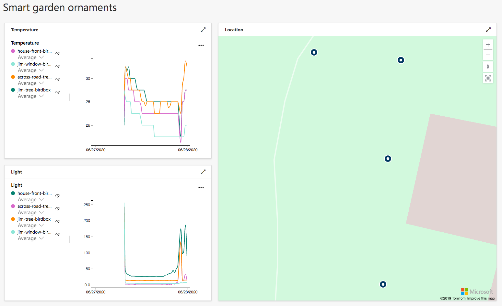
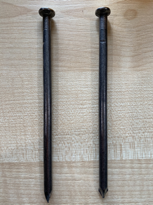
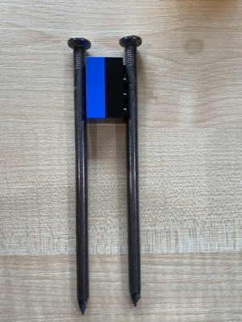
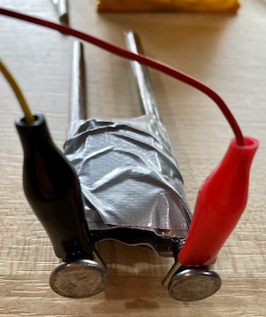
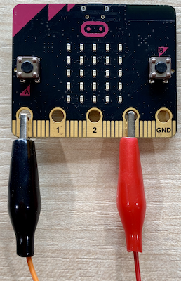
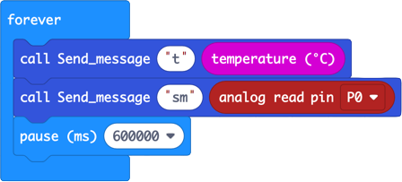
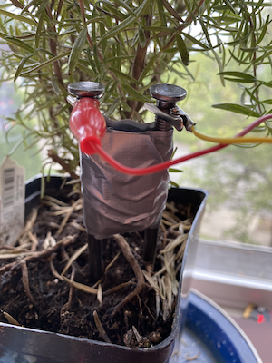

# Day 5 - add more sensors to gather more data

> 
>
> **This day has sections that require someone confident in setting up and programming a Raspberry Pi, and sections requiring someone confident using block based programming on a BBC micro:bit. You will also need access to IoT Central to add new data types to the device template**

Yesterday you built the smart garden ornaments and set them up around your house. Today's project is to add more sensors to capture more data.

So far you've used the temperature sensor built into the micro:bit. But this is not the limit - there are so many more sensors you can use to gather data! Todays part will cover two sensors - one on board and one external. You will learn how to add a new sensor and start gathering data

The steps you'll take to do this are:

* Build or wire up the sensor if required
* Add code to the micro:bit to gather data from the sensor
* Add code to the Pi to understand the sensor value
* Add the new sensor value to IoT Central and show it on the dashboard

## Light sensors

A light sensor is the simplest sensor to add as the micro:bit already has one on-board, meaning no external hardware needed.

> This light sensor is not particularly accurate, as it uses the LEDs as light sensors. You can read more on this in the [micro:bit light sensor documentation](https://support.microbit.org/support/solutions/articles/19000024023-how-does-the-light-sensing-feature-on-the-micro-bit-work-).

### Add light values to IoT Central

In IoT Central, a device template was configured to receive temperature values and plot these on a graph. To add new sensor data, the device template needs to be configured to accept another value.

#### Version the interface

THis is not a simple case of adding a new value to the templates. Device templates cannot be changed once they are published and available to use, this is to stop someone breaking a template that has been published with thousands of devices sending data. Instead, you can create a new version of the existing device template, and add a new telemetry value to it. Once this new version has been created, devices can be migrated to this new version.

1. Open your IoT Central app

1. From the side bar menu select **Device templates**

    

1. Select the `Smart garden ornament` device template

    

1. Select the **Version** button to create a new version of this template

    

1. Leave the new name as `Smart garden ornament v2`, and select the **Create** button

    

1. Select the *Interface*

    

1. Select **Version** from the interface menu

    

1. Select **Create** from the dialog

    

The new interface version will be created as a copy of the original. The `Temperature` value will be there, with some fields read-only. For example, you can't change the name, the capability type or schema - doing so would break what existing devices can send.

#### Add the new capability

1. Add a new capability in the same way you did to add temperature originally. Set the *Display name* and *Name* to `Light`. Leave the *Capability type* as `Telemetry`, the *Semantic type* as `None` and the *Schema* as `Double`.

    

1. Select **Save**

1. Select the *micro:bit data* view

    

1. Add the Light tile in the same way you did for temperature, and configure it how you want

    

1. Select **Save**

#### Publish the new interface

1. Select **Publish** from the top menu

    

1. Select **Publish** from the publish dialog that appears

    

#### Migrate devices

1. From the side bar menu select **Devices**

1. Select the *All devices* group

1. Select all the devices by selecting the check box at the start of each row

    

1. Select **Migrate**

    

1. Select the *Smart garden ornament v2* template, then select **Migrate**

    

1. A progress dialog will pop out the side and show migration progress. Close this once the devices have been migrated.

    

### Add a mapping to the Hub for the light values

Once IoT Central is ready to receive light values, a mapping needs to tbe added to the Hub so that the micro:bits can send the light values using a code to keep the meesgae size down.

1. From the Pi, open the `mappings.py` file

1. Edit the `value_types` dictionary to have a new entry mapping `l` to `Light`

    ```python
    value_types = {
        "t" : "Temperature",
        "l" : "Light",
    }
    ```

1. Reboot the Pi to start the code with the new mappings

### Send the light value from the micro:bit

1. Edit the code for the micro:bits used in the smart garden ornaments

1. Add a new `call Send_message` block from the **Functions** toolbox to the `forever` block

    

1. Set the `Type` parameter to `"l"`

1. Drag a `light level` block from the **Input** toolbox to the `value` parameter

    

1. Download this code to all the micro:bits. Don't forget to update the device IDs as you download the code.

### See the Light values in IoT Central

The dashboard in IoT Central show the device locations and temperature values. To show light values, a new tile needs to be added.

1. Open your IoT Central app

1. From the side bar menu, select **Dashboard**

1. Select the **Edit** button on the top menu

1. Add and configure a tile for the Light values in the same way you added the Temperature tile. Ensure all the devices are selected and the time range matches the time range you set for the temperature.

> This can be a bit quirky, sometimes the new property doesn't appear. If this happens create a brand new dashboard with temperature, light and the locations showing, then delete the first dashboard



## Soil moisture

A great way to monitor plants is using a soil moisture sensor - if the soil is too dry then your plant needs watering. These sensors range from the expensive that you would use in professional digital agriculture, to home made using nothing more than two bits of metal. This guide will show you how to make your own.

To make this sensor, you will need the following:

* 2 pieces of metal, such as long nails
* A spall piece of wood, plastic or other non-conductive material that can keep the nails about 2cm apart
* Gaffer tape
* 2 jumper leads with crocodile clips
* Appropriate waterproofing, such as a recyclable plastic bag

### Make a sensor

Soil moisture sensors measure the amount of water in soil by measuring how much current can be carried through the soil between two conductive probes in the soil. Essentially a voltage is applied to one probe, and the voltage at another probe a couple of centimeters away is measured. The wetter the soil, the more electricity can flow and the higher the voltage that is read from the second probe.

These probes don't need to be anything particular, they just need to be able to carry a voltage. This means you can use any metal objects, such as a nails.

These sensors don't measure a value at a known level - this isn't like a temperature sensor that can measure temperature in celsius and you would get consistent values between sensors. Instead these are more something you would self-calibrate, as in use your knowledge of the soil to see if it is too dry, and correlate that back to the measurement.

For example, if you have these readings when the soil is too dry, ok, and wet:

| Soil moisture | Reading |
| ------------- | ------- |
| Wet           | 800     |
| Just right    | 600     |
| Too dry       | 400     |

Then you know if your soil moisture measurement is less than say 500, you should water your plant. The type of soil, how deep the probes are in the soil, and the material the probes are made out off all affect the reading. Essentially though, if you want to get reasonably consistent data across your neighborhood, make sure all your moisture sensors are the same.

To make mine, I used two 15cm nails.

.

1. These nails need to be a consistent distance apart, about 2cm. To do this, fix the nails either side of a 2cm piece of wood, plastic or other non-conducting material. 2 lego bricks do nicely.

    

1. Tape these nails in place with gaffer tape. Leave enough room at the top of the nails to attach wires.

    

1. Both nails need to be attached to wire, with the other end of the wire attached to pins on the micro:bit. Wires that end in crocodile clips are the best for this as you can attach them to both the nails and the micro:bit.

    

1. Finally, attached the other end of the crocodile clips to the micro:bit. Fix one to the **3V** pin, and the other to pin **0**.

    

### Program the micro:bit

The pins on a micro:bit can measure an analog signal, on a scale of 0-1023. This signal comes from anything that provides power, such as a connection to the 3V power supply via nails and moist soil.

> This reading is not a 'moisture' level, it is a measure of how much of the 3V makes it from one nail to another, which can give an indication of soil moisture.

The 3V pin always provides power, so to get a moisture reading, the micro:bit needs to take an analog reading at pin 0.

1. Open the smart garden ornament project in MakeCode

1. Drag a **Call Send_message** block from the *Functions* toolbox item to the **forever** block

    

1. Change the first parameter to `sm`

1. For the second parameter, expand the *Advanced* toolbox item, and select *Pins*

1. Drag a **analog read pin** block to the second parameter

    

1. Ensure the device ID is correct, and deploy the code to your micro:bit

### Position the sensor

The sensor needs to be positioned in soil, with as much of the nail in the soil as possible, up to where they are joined.

With the positioning, you also need to consider moisture levels and if the micro:bit could get wet. If necessary, wrap the crocodile clips, micro:bit and battery pack in a plastic bag.

Choose an ornament that is ground based as well, such as a gnome. If you want to use something that is higher up, such as a bird box, use longer wires to connect to the sensor.



### Program the Pi

The `mappings.py` file needs to have a mapping added for the new `sm` value.

1. Open the `mappings.py` file on the Pi

1. Add an entry to the dictionary to map `sm` to `SoilMoisture`. Note there isn't a space, `SoilMoisture` is all one word.

    ```python
    value_types = {
        "t" : "Temperature",
        "sm" : "SoilMoisture",
    }
    ```

1. Reboot the Pi to restart the Hub with the new mapping

### Show the data in IoT Central

To add the sensor data, repeat the steps above to add a new data type into a new version of the IoT Central device template.

1. Set the *Display name* to `Soil Moisture`

1. Set the *Name* to `SoilMoisture`

1. Leave the *Semantic type* as `None` and the *Schema* as `Double`


Once the interface has the `Soil Moisture` item and is published, update the dashboard to show the soil moisture level.


## Summary

Today is the last day of hands on workshops, but not the last day of this project! Keep on going, collecting data, making more smart garden ornaments and adding more sensors!

Please share what you have done with the world. If you have added a new sensor, please raise a PR to add it here. Add your setup and stories to the [stories](./stories) folder. We'd love to hear what smart ornaments you have created, how large your mesh is, what fun things you've found out.